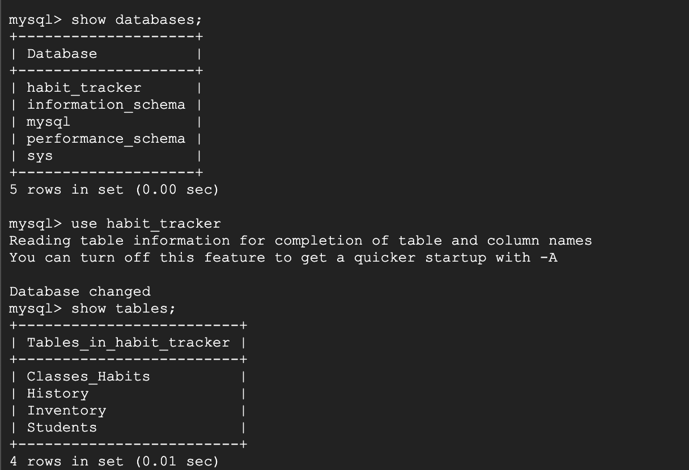

# Database Design

## DDL commands 

We made slight changes to our database design since the last stage, namely deciding to use the student login as primary key instead of student name.

### All Tables



### Students table


```sql
CREATE TABLE Students (Name VARCHAR(255), Location VARCHAR(255), Login VARCHAR(255), PRIMARY KEY (Login));
```


### Habits table


```sql
CREATE TABLE Classes_Habits(Habit INT NOT NULL, Student VARCHAR(255) NOT NULL, Location VARCHAR(255), Time DATETIME, PRIMARY KEY (Habit, Student), FOREIGN KEY (Student) REFERENCES Students(Login));
```


### Inventory table


```sql
CREATE TABLE Inventory(Student VARCHAR(255) NOT NULL, Item VARCHAR(255) NOT NULL, PRIMARY KEY(Student, Item), FOREIGN KEY (Student) REFERENCES Students(Login) ON DELETE CASCADE);
```


### History table


```sql
CREATE TABLE History(Time DATETIME, Student VARCHAR(255), Habit INT, PRIMARY KEY (Time, Student, Habit), FOREIGN KEY(Student) REFERENCES Students(Login), FOREIGN KEY(Habit)
REFERENCES Classes_Habits(Habit));
```


### Queries

This variable is to designate the currently logged-in student

```sql
DECLARE currentStudent AS VARCHAR(255)
```

This first query is to display a student's schedule with times they successfully followed that habit

```sql
SELECT DISTINCT Habit, Location, COUNT(y.Time)
FROM Habits h JOIN History y ON y.Habit=h.Habit
WHERE h.Student=currentStudent
GROUP BY Habit
ORDER BY h.Time
```

This second query displays a students inventory and calculate the relative rarity of an item compared to how many exist in other student's inventories

```sql
SELECT Item, COUNT(Student) rarity
FROM Inventory
GROUP BY Item HAVING EXISTS(SELECT Item FROM Inventory WHERE Student=currentStudent)
ORDER BY rarity DESC
```

### Indexing 

#### Indexing Second Query

#### Initial Explain Analyze:


When we first ran the Explain Analyze, we could see the leaf level was an index scan of the Inventory table and not a full table scan. So, when we tried adding an index to the Student in the Inventory table we did not see any improvement. 


The same holds true for adding an index to Items, we do not see improvement (cost remains 101.50) 


Finally we attempted adding an Index that only uses SOME of the Student key as we had tried indexing all the full keys. These indexes did not improve the cost because Student is a primary key and must be searched to tell apart different entries that have the same Item.


Overall we were not able to improve the cost of this query with Indexing. The main reason we were not able to improve is because this query only searches the Inventory table. The Inventory table only has 2 keys which are both primary keys. This means both these entries are needed in full and indexing does not improve cost.


