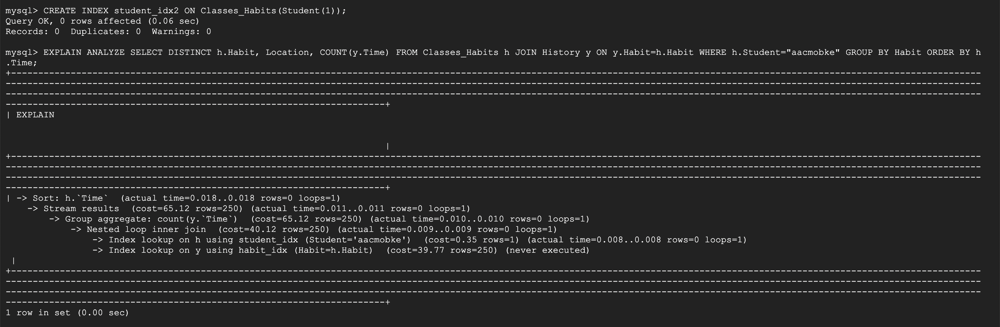

# Database Design

## DDL commands 

We made slight changes to our database design since the last stage, namely deciding to use the student login as primary key instead of student name.

### Students table


```sql
CREATE TABLE Students (Name VARCHAR(255), Location VARCHAR(255), Login VARCHAR(255), PRIMARY KEY (Login));
```


### Habits table


```sql
CREATE TABLE Classes_Habits(Habit INT NOT NULL, Student VARCHAR(255) NOT NULL, Location VARCHAR(255), Time DATETIME, PRIMARY KEY (Habit, Student), FOREIGN KEY (Student) REFERENCES Students(Login));
```


### Inventory table


```sql
CREATE TABLE Inventory(Student VARCHAR(255) NOT NULL, Item VARCHAR(255) NOT NULL, PRIMARY KEY(Student, Item), FOREIGN KEY (Student) REFERENCES Students(Login) ON DELETE CASCADE);
```


### History table


```sql
CREATE TABLE History(Time DATETIME, Student VARCHAR(255), Habit INT, PRIMARY KEY (Time, Student, Habit), FOREIGN KEY(Student) REFERENCES Students(Login), FOREIGN KEY(Habit)
REFERENCES Classes_Habits(Habit));
```


## Queries

This variable is to designate the currently logged-in student

```sql
DECLARE currentStudent AS VARCHAR(255)
```

This first query is to display a student's schedule with times they successfully followed that habit

```sql
SELECT DISTINCT Habit, Location, COUNT(y.Time)
FROM Habits h JOIN History y ON y.Habit=h.Habit
WHERE h.Student=currentStudent
GROUP BY Habit
ORDER BY h.Time
```

This second query displays a students inventory and calculate the relative rarity of an item compared to how many exist in other student's inventories

```sql
SELECT Item, COUNT(Student) rarity
FROM Inventory
GROUP BY Item HAVING EXISTS(SELECT Item FROM Inventory WHERE Student=currentStudent)
ORDER BY rarity DESC
```

## Indexing 

### Indexing First Query

#### Initial Explain Analyze:


When running explain analyze with default indexing, we can see that the lowest levels were look ups on the Student and History tables, where the lookup on History had a rather significant cost. Thus, we decided to add an index to the Habit field in History to see if it would offer improvements:

However, it seems that creating the index on the Habit column actually slowed down the query. Furthermore, we discovered that we were unable to remove the index as it is now needed in a foreign key constraint.

We next attempted to index the Student field in the Habit table:

This did not impact improvement, which was expected since Student is already part of the primary key for Habit.

Finally, we tried to index only ```currentStudent``` in the Habit table:

This once again did not impact improvement, most likely for the same reason as for the index attempt above.

Since none of these three indexing methods we tried improved performance for this first query, and in fact slowed down the search speed, we have decided to not use any indexes.

### Indexing Second Query

#### Initial Explain Analyze:


When we first ran the Explain Analyze, we could see the leaf level was an index scan of the Inventory table and not a full table scan. So, when we tried adding an index to the Student in the Inventory table we did not see any improvement. 


The same holds true for adding an index to Items, we do not see improvement (cost remains 101.50) 


Finally we attempted adding an Index that only uses SOME of the Student key as we had tried indexing all the full keys. These indexes did not improve the cost because Student is a primary key and must be searched to tell apart different entries that have the same Item.


Overall we were not able to improve the cost of this query with indexing. The main reason we were not able to improve is because this query only searches the Inventory table, which only has 2 keys and are both primary keys. This means both these fields are already index and thus setting any more indexes will not improve the performance.


