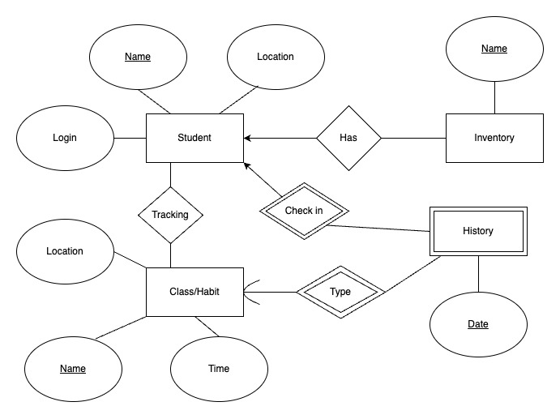

# ER Diagram

## Assumptions about the diagram
A student can have many things in their inventory but each inventory item should only be associated with at most one student.  (one to many)

A student can have many history entries of habits in their history, but each history entry can only belong to exactly 1 student. (one to many)

A student can have many classes and habits they can track and classes or habits can belong to multiple students. Students can be in the same class or be tracking a common habit like sleeping. (many to many)

There can be many history entries tracked for a class or habit, but each individual history entry has to be for exactly 1 habit/class. (one to many)

## Relations and descriptions
- Student(Name:VARCHAR(255)[PK], Location:VARCHAR(255), Login:VARCHAR(255))
  - Cardinality: 3
- Classes_Habits(Name:VARCHAR(255)[PK], Student:VARCHAR(255)[FK to Student.Name], Location:VARCHAR(255), Time:DATETIME)
  - Cardinality: 4
- Inventory(Name:VARCHAR(255)[PK], Student:VARCHAR(255)[FK to Student.Name])
  - Cardinality: 2
- History(Time:DATETIME[PK], Student:VARCHAR(255)[FK to Student.Name], Habit:VARCHAR(255)[FK to Habits.Name])
  - Cardinality: 3

