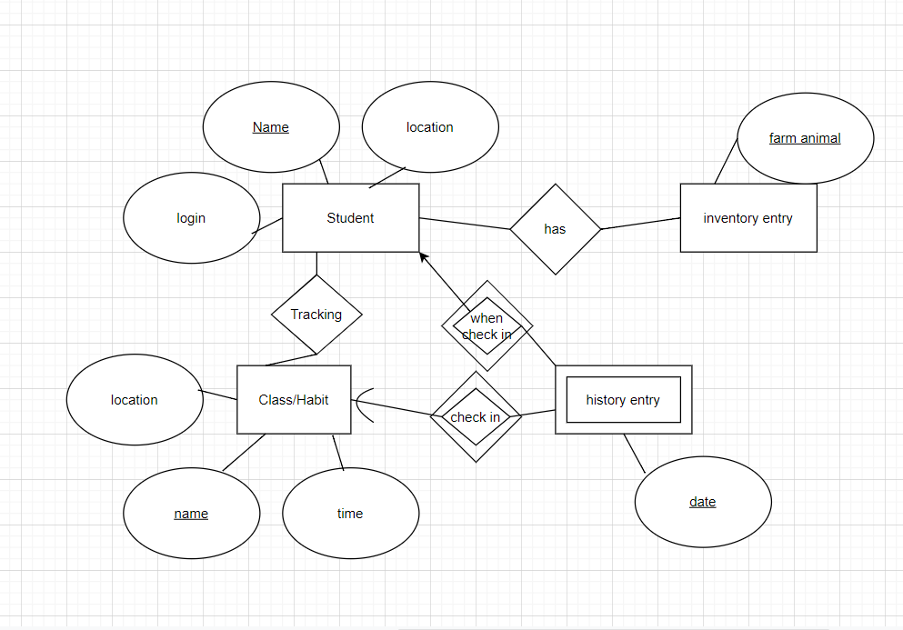

# ER Diagram

## Assumptions about the diagram
A student can have many things in their inventory and there can be many inventory items associated with each student.  (many to many)

A student can have many history entries of habits in their history, but each history entry can only belong to 1 student. (one to many)

A student can have many classes and habits they can track and classes or habits can belong to multiple students. Students can be in teh same class or be tracking a habit like sleeping. (many to many)

A class or habit can be in many history entries for each time the habit is tracked but each individual history entry has to include 1 habit/class. (one to many)