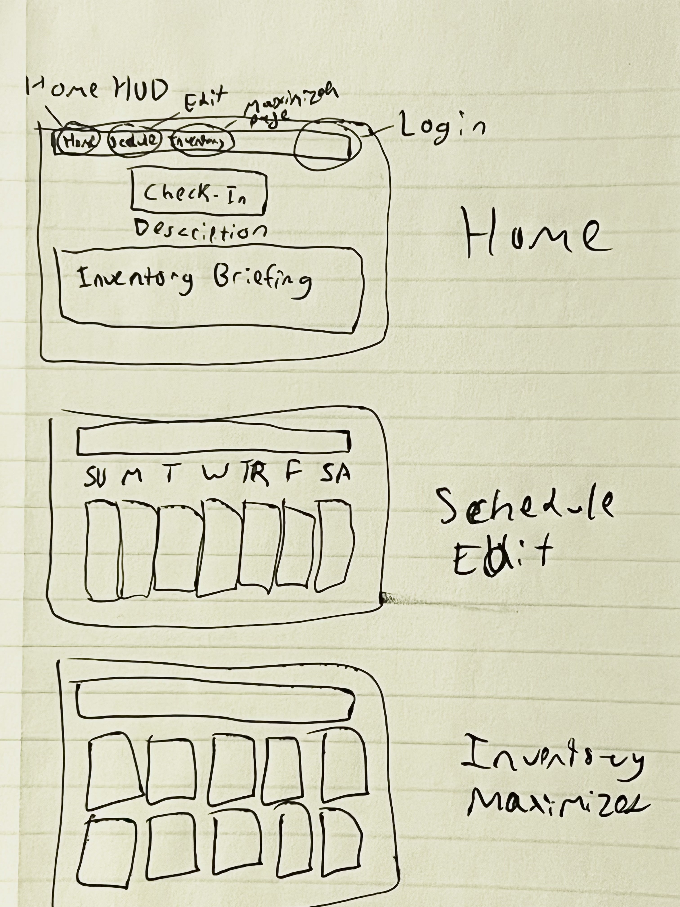

# Project Proposal

## Describe what data is stored in the database. (Where is the data from, what attributes and information would be stored?)
Data stored in the database include:
- a students table to store student information (student name, student ID, etc.)
- a credential table to store log in data (usernames and passwords) as well as 
- a schedules table to store students' class schedules
- an inventory table to store students' rewards

Most of the data stored will come from the users, as it is all very individualized.

## What are the basic functions of your web application? (What can users of this website do? Which simple and complex features are there?)
Basic functions of the web application include user account creation and log in, entering their schedules, checking into their classes, and viewing their inventories.

## What would be a good creative component (function) that can improve the functionality of your application? (What is something cool that you want to include? How are you planning to achieve it?)

A good creative component could be allowing students to level up items in their inventory after they've collected a certain number of duplicated items. This improves functionality because it increases variety and possibily provides more incentive for the user to attend more classes. 

## Project Title: Greener Pastures

## Project Summary:  It should be a 1-2 paragraph description of what your project is.

Greener Pastures is a web-based habit tracker that serves as an organized checklist for building a person's ideal schedule. For a student, this looks like attending classes, set aside study time, and time for other hobbies. It also can incorparate a regular sleep schedule and exercise routinue. The main purpose of the application is to build organized task-orientated habits.
As a way to track progress, users will be rewarded with a pet/creature with randomly assigned color scheme. The more a user sticks to their schedule the more rare their creatures will be, signified by more exotic color schemes.

## Description of an application of your choice. State as clearly as possible what you want to do. What problem do you want to solve, etc.?
This application serves as a habit tracker. It will help students form good habits such as coming to class and showing up on time. The students can track their attendance and when they log into their classes each day. This is also 1 website to log into classes so students don’t have to juggle using multiple platforms for all of their classes. This application will allow students to log in and click a button telling them to check into whichever class is at that time. Then there will be a popup telling them if they are late or not. If they are not late they will get an item to put in their inventory as a reward.

## Usefulness. Explain as clearly as possible why your chosen application is useful.  Make sure to answer the following questions: Are there any similar websites/applications out there?  If so, what are they, and how is yours different?
This application is useful as it will help the user accomplish the challenge of forming positive habits. Studies show in order to form a habit you need to do something consistently for 5-6 weeks minimum. Our app’s features will help incentivize a student to go to class and create the positive habit of getting out of the apartment and attending all their classes. The application will also help students by keeping all the information about their classes in one place as opposed to searching many sites.

There are some products out there that do something similar, but no existing app accomplishes everything we are trying to accomplish with this project. For example students could upload their schedule into google calendar to remember when everything is, but they would have to keep track of attendance on their own. Google calendar also does not have incentives to create a habit of going to class. 

## Realness.  Describe what your data is and where you will get it.
A lot of the data for this project will be provided by the user. The app will have features where the student can build their own schedule in the app and edit the details of the classes. The app will also allow the user to check in to class, in order for the user to check in the app must gather data about the current time and the user’s current location. This information could be gathered by implementing the project as a webpage or mobile application and gathering the location and time from the webpage/phone. Finally, the project will also have data representing possible awards for students to earn when they go to class. Included in these awards the app must keep track of which awards the student has already earned. 

## Description of the functionality that your website offers. This is where you talk about what the website delivers. Talk about how a user would interact with the application (i.e. things that one could create, delete, update, or search for). Read the requirements for stages 4 and 5 to see what other functionalities you want to provide to the users. You should include:
The user would log into the application and there would be a button on the screen to log into a class based on what time it is and which class it is. When they click the button, it will tell the student if they were late to this class or not. There is also going to be a page where a student can upload their class schedule. They will just enter in the class name, the time, the location, and the professor. Another function our website will offer is an option to delete a class from a student's schedule. If a student drops a class, they can go into their log in on the website and delete that class from their schedule. There will also be an option to update details of the class such as location or time if that class ends up moving to another classroom or doesn’t meet that week. The last function our website would offer is a page with the students inventory. This page will hold the items the student has earned from being on time and offer a search function.

## A low fidelity UI mockup: What do you imagine your final application’s interface might look like? A PowerPoint slide or a pencil sketch on a piece of paper works!

## Project work distribution: Who would be responsible for each of the tasks or subtasks?
Brooke: CRUD schedule implementation
* Scheduling interface on web app page
* Creating a schedule
* Querying specific classes

Rainy: Check-In database triggers and functionality
* Check-In interface
* Database that stores user history
* Querying user progress (successes, streaks, etc)

Michael: Login system and account interaction
* Login interface
* User and password database
* Linkage between schedule, history, and inventory databases

Landon: Inventory management, item procuring and generation
* Inventory interface
* Reward logic
* Item generation
* Item merging
